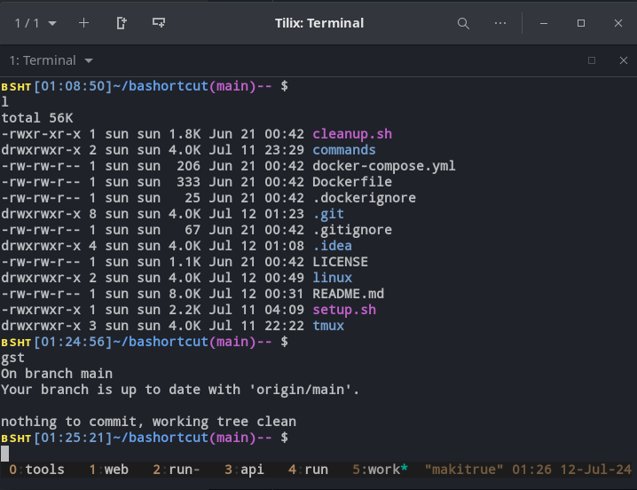

# 🧰 BASHORTCUT - OS LAYER 4 DEVELOPERS

**Philosofy**: automate and shortcut repetitions to decrease charge and increase fluidity

## ☀️ Features

- Customize the OS: **Dock**, **Mouse Speed**, **Sound**, **Energy** and more...
- Install tools: **Tmux**, **Git**, **Docker**, **Spotify**, **JetBrains Toolbox**, **Go**, **NVM** and more...
- Load the BSHT profile: **Aliases**, **Prompt** and **Commands**

Tested on Ubuntu Budgie 24.04 LTS.
Should be compatible at least with all Debian-based distributions.

## 📖 Plan

- [Setup & Cleanup](#-setup--cleanup)
- [BSHT Profile](#-bsht-profile)
  - [Prompt](#-prompt)
  - [Aliases](#-aliases)
  - [Commands](#-commands)
- [Tmux Boilerplate](#-tmux---terminal-multiplexer---boilerplate)
- [TODO](#-todo)

## 📜 Setup & Cleanup

The Setup script ask iteratively questions to customize the OS, install tools and install the BSHT profile.

The Cleanup script deactivate the BSHT profile, remove the tmux configuration and notes (it needs a rework).

### ⚙️ **Install**

```bash
cd ${HOME}
git clone https://github.com/Ambre-io/bashortcut.git
sh setup.sh
```

### ⬇️ **Update**

```bash
cd ${BASHORCUT}
git checkout main
git pull
```

### 🗑️ **Delete**

```bash
cd ${BASHORTCUT}
sh cleanup.sh
```

### 💡 Try

```bash
# IN A LOCAL SHELL
cd ${HOME} && git clone https://github.com/Ambre-io/bashortcut.git && cd bashortcut
docker compose build && docker run -it bashortcut bash
# IN A DOCKER IMAGE INTERACTIVE SHELL
bash bashortcut/setup.sh  # install script
# answer 'y' for tmux and git, 'n' for others
# password is 'docker'
source /home/bashortcuser/.bashrc  # then source as asked
cd bashortcut  # discover the prompt with git information
example  # discover the simple tmux session
```

## ⭐ BSHT profile

The BSHT profile is a set of Prompt, Aliases, Commands and some Development Tools configuration that enhance 
the terminal experience. This is the BSHT profile inking file in OS. It is included in the `.bashrc` file. 

<p align="center">
    
</p>
<p align="center">
   <span style="color: #D724FF; font-size: 11px">BSHT profile, with the Prompt, using Aliases, in a Tmux session</span>
</p>

### 🖥️ Prompt

BSHT profile optimizes prompt usage with cursor placement, useful information and color coding based on terminal profile: 

</span><span style="color:#FFCC00FF">
ʙsʜᴛ</span><span style="color:#8CFF00FF"><span style="color:#55c6e7">[&lt;time&gt;]</span><span style="color:#55c6e7">&lt;path&gt;</span><span style="color:#8CFF00FF">(&lt;git branch name&gt;)&lt;git sign&gt;</span> $

</span><span style="color:#FFCC00FF">
ʙsʜᴛ</span><span style="color:#8CFF00FF"><span style="color:#55c6e7">[12:12:34]</span><span style="color:#55c6e7">~/bashortcut</span><span style="color:#8CFF00FF">(main)↑</span> $

- branch and sign color depend on git status
- sign depends on git status
- **$** is the same color as the terminal text (Foreground) or red on error
- colors are customizable in
  the [.bsht_prompt](https://github.com/Ambre-io/bashortcut/blob/main/linux/.bsht_prompt#L148) file
- you can add the old `<user>@<computer name>` part in
  the [.bsht_prompt](https://github.com/Ambre-io/bashortcut/blob/main/linux/.bsht_prompt#L148) file

### 💨 Aliases

At the beginning, in 2016, it was a brilliant R&D colleague who introduced me to aliases and showed me how to use them very quickly. 
The main goal is to follow the flow of ideas. I liked it so much, I instantly created my own.

There are now more than **120 Aliases** in the BSHT profile. To learn them you can:
- use `oops` in a terminal using BSHT profile
- read them in the [.bsht_aliases](https://github.com/Ambre-io/bashortcut/blob/main/linux/.bsht_aliases) file

### 🛠️ Commands

Then, when an alias becomme to big or too complex, it evolves into a command. It also can aswer to a specific need.

BSHT profile comes with this set of [Commands](https://github.com/Ambre-io/bashortcut/tree/main/commands)
(not loaded by default):

| Command                          | Description                                                 |
|----------------------------------|-------------------------------------------------------------|
| **create_tmux_session.sh**       | (alpha) CLI to create a tmux session.                       | 
| **customize_dock.sh** 👣         | CLI to custom the Dock (position, size...).                 |  
| **customize_git_user.sh**        | CLI to change the git user in global config.                |  
| **customize_os.sh** 👣           | CLI to custom Mouse speed, Sound, Battery and notes.        |   
| **customize_resolution.sh**      | Change the current resolution to 1920x1080 by default.      |  
| **customize_bsht_profile.sh**    | Load Aliases, Prompt and Commands.                          |  
| **install_curl.sh**              | Install curl.                                               | 
| **install_docker.sh**            | Install and Launch Docker Engine.                           | 
| **install_gedit.sh**             | Install Gedit if not already installed.                     | 
| **install_git.sh**               | Install Git and Configure initial user.                     | 
| **install_go.sh**                | Clean install of latest Go lang version.                    | 
| **install_jetbrains_toolbox.sh** | Clean install of latest JetBrains Toolbox.                  | 
| **install_mongocompass.sh**      | Install latest Mongo-Compass.                               | 
| **install_nvm.sh**               | Install latest Node Version Manager and Node.               | 
| **install_spotify.sh**           | Install Spotify for the flow.                               | 
| **install_tmux.sh**              | Install [Tmux](#-tmux---terminal-multiplexer---boilerplate) | 
| **install_zfs_alert.sh**         | Check if everything is ok on a ZFS pool.                    |
| **shortcuted.sh**                | Create a symlink for a given file in /usr/local/bin.        | 

👣 gnome-based commands

**2 ways to load a command:**

➡️ `shortcuted.sh ./<command.sh>`

➡️ `sudo ln -s ${BASHORTCUT}/commands/<command.sh> /usr/local/bin`

## 🪟 Tmux - Terminal Multiplexer - Boilerplate

Before, I turned on all my dev tools for 15 minutes every morning. 

Now, I type the (autocompleted) Tmux session name that launches the whole working environment.

Thanks to a Tmux session I take 15 minutes to have a coffee with my colleagues.

### A Tmux session is a set of windows and panes executing commands that can be saved and restored in a shell script:

- windows 0: run editors and tools
- windows 1: show frontend git status
- windows 2: run frontend server and logs
- windows 3: show backend git status
- windows 4: run backend server and logs
- windows 5: show bashortcut status
- windows 6: work (generic one with the Zen of Python)

### Boilerplate - Try and Create your own Tmux session:

- Find the tmux config file [.tmux.conf](https://github.com/Ambre-io/bashortcut/blob/main/tmux/.tmux.conf) and a tmux
  session [tmux/example](https://github.com/Ambre-io/bashortcut/blob/main/tmux/example)
- Try locally the example tmux session with `./example`
- Create your session by copying the `example` file or using `create_tmux_session.sh` command
- Put your sessions in `sessions/` gitignored folder
- Don't forget to link your new sessions `shortcuted.sh ${BASHORTCUT}/tmux/sessions/<session_name>`
- Good usage helper: https://tmuxcheatsheet.com/

## 📋 TODO

- [ ] Plank Dock arguments
- Appearance > Icon Zoom
- Behavior > Hide Dock
- [ ] Custom Top Panel
- change size to 24 (height)
- change Transparency to Always
- shadow Node
- Applets : (start) AppMenu, ShowTime, (center) Clock, Weather Show, (end) Show Desktop Button, AppIndicatorApplet,
  Keyboard Layout, Network, Status Indicator, Separator, User Indicator, Raven Trigger
- [ ] Cleanup Script
- Soft cleanup
- Hard cleanup
- [ ] Custom Firefox
- Disable alt
- [ ] Find a way to save private Tmux sessions and retrieve them easily
- [ ] Customize gThumb
- Viewer > Mouse wheel action > Zoom image
- shortcuts > viewer > show next file <=> Right
- shortcuts > viewer > show previous file <=> Left
- shortcuts > viewer > show first file <=> space
